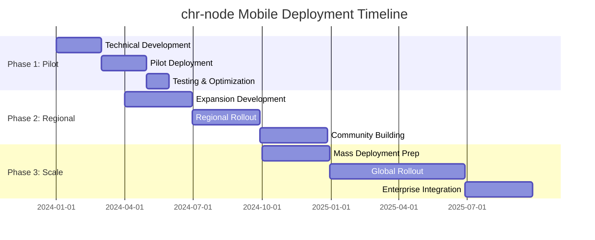

# chr-node Mobile Termux Deployment Strategy for Emerging Economies

## Executive Summary

This document outlines the comprehensive deployment strategy for chr-node using Termux on Android devices in emerging markets. The strategy leverages all 21+ Termux APIs for ultra-lightweight P2P networking, optimized for devices with limited resources, expensive data, and intermittent power supply.

## Target Market Analysis

### Primary Target Demographics
- **Geographic Focus**: Sub-Saharan Africa, Southeast Asia, Latin America, South Asia
- **Device Profile**: Android 5.0-9.0, 512MB-2GB RAM, ARM processors
- **Economic Context**: $1-5 daily income, prepaid mobile plans, shared device usage
- **Connectivity**: 2G/3G primary, WiFi when available, data costs 5-15% of income

### Device Classification Matrix
```
Ultra Low-End    | <512MB RAM  | Single core    | Android 5-6  | Emergency Only Node
Low-End         | 512MB-1GB   | Dual core      | Android 6-7  | Minimal Lite Node  
Mid-Range       | 1-2GB       | Quad core      | Android 7-8  | Optimized Lite Node
High-End        | 2GB+        | Octa core      | Android 8+   | Standard Lite Node
```

## Technical Architecture

### Core Components

#### 1. Termux API Integration Layer
```elixir
# All 21+ APIs integrated with fallback strategies
ChronaraNode.Termux.APIIntegration
├── System APIs (9): battery, clipboard, volume, brightness, toast, dialog, notification, wallpaper, contacts
├── Hardware APIs (8): camera, location, sensor, vibrate, torch, microphone, fingerprint, keystore  
├── Communication APIs (7): telephony_call, telephony_deviceinfo, sms_send, sms_list, wifi_connectioninfo, wifi_scaninfo, nfc
└── Advanced APIs (7): tts, stt, infrared, usb, storage, share, download
```

#### 2. Emerging Markets Optimizer
```elixir
# Resource optimization based on device classification
ChronaraNode.Termux.EmergingMarketsOptimizer
├── Memory Management: 32MB-256MB heap limits
├── Network Optimization: 1-25 peer connections
├── Power Management: CPU throttling, sleep modes
└── Data Conservation: compression, WiFi-only modes
```

#### 3. Comprehensive Testing Suite
```elixir
# Device classification and API validation
ChronaraNode.Termux.ComprehensiveTestSuite
├── Device Classification: hardware profiling, constraint analysis
├── API Availability Testing: all 21+ APIs tested systematically
├── Performance Benchmarking: latency, throughput, battery drain
└── Deployment Recommendations: tier-based configuration
```

## Deployment Phases

### Phase 1: Pilot Deployment (Months 1-3)
**Target**: 100 nodes across 3 countries

#### Selection Criteria
- Urban/semi-urban areas with 3G+ coverage
- Local tech community presence
- Government regulatory clarity on P2P networking
- Partner organizations for distribution and support

#### Pilot Countries
1. **Kenya**: Nairobi, Mombasa (English-speaking, tech-forward)
2. **Philippines**: Manila, Cebu (high Android adoption, island connectivity needs)
3. **Brazil**: São Paulo, Rio (large market, economic disparity)

#### Technical Setup
```bash
# Termux installation package
termux-chr-node-pilot.apk
├── Base Termux installation
├── Termux:API add-on
├── chr-node binary (ARM64/ARM7 optimized)
├── Automated configuration script
└── Local language UI pack
```

#### Success Metrics
- 80% successful installation rate
- 70% of nodes online after 7 days
- <5% battery drain per hour when active
- Peer discovery within 2 minutes in urban areas
- Data usage <100MB per month per node

### Phase 2: Regional Expansion (Months 4-9)
**Target**: 2,500 nodes across 8 countries

#### Expansion Strategy
- Scale successful pilot regions to secondary cities
- Add new countries based on pilot learnings
- Introduce mesh networking capabilities
- Launch community incentive programs

#### New Target Countries
4. **Nigeria**: Lagos, Abuja (largest African economy)
5. **India**: Mumbai, Bangalore (massive Android market)
6. **Indonesia**: Jakarta, Surabaya (archipelago mesh networking)
7. **Mexico**: Mexico City, Guadalajara (North American gateway)
8. **Vietnam**: Ho Chi Minh, Hanoi (manufacturing hub connectivity)

#### Enhanced Features
- Multi-language support (Spanish, Portuguese, Bahasa, Hindi, Swahili)
- Offline-first mesh networking
- Community reward system (CHAI token distribution)
- Local technical support network

### Phase 3: Mass Deployment (Months 10-18)
**Target**: 25,000 nodes across 15+ countries

#### Distribution Channels
1. **Mobile Operator Partnerships**: Pre-install on budget Android devices
2. **NGO Partnerships**: Digital inclusion programs
3. **Educational Institutions**: Student-run node programs  
4. **Microfinance Integration**: Node ownership as income generation
5. **Community Centers**: Shared access points

#### Technical Enhancements
- AI-powered network optimization
- ProAgent trading automation
- xNomad.fun NFT integration
- Cross-chain CHAI rewards
- Enterprise lite-node variants

## Resource Optimization Strategy

### Ultra-Minimal Configuration
```yaml
# Emergency-only nodes (<512MB RAM)
max_heap_size: 32MB
max_peers: 1
connection_timeout: 60s
data_compression: extreme
background_pause: 10min
features_disabled: [debug_logging, detailed_metrics, peer_analytics]
```

### Data Conservation
```yaml
# For expensive data plans
compress_all_traffic: true
wifi_only_sync: true
background_data_limit: 10MB/day  
cache_duration: 7days
telemetry_reduction: 90%
```

### Power Management
```yaml
# For limited battery capacity
cpu_throttle: powersave_governor
sleep_timeout: 30s
wake_on_message: true
screen_brightness: auto_minimum
vibration: disabled
```

## Economic Model

### CHAI Token Integration
- **Node Rewards**: 0.1-10 CHAI per day based on uptime and connectivity
- **Data Sharing**: Additional rewards for bandwidth sharing
- **Micro-transactions**: Local payments using CHAI
- **Staking Rewards**: Long-term node operators earn additional tokens

### Cost Structure (per node/month)
- **Data Usage**: $0.50-2.00 (50-200MB)
- **Power Consumption**: $0.10-0.50 (charging costs)
- **Total Operating Cost**: $0.60-2.50
- **Potential Rewards**: $2-15 in CHAI tokens
- **Net Benefit**: $1.40-12.50 monthly income

### Affordability Targets
- Initial setup cost: <$0 (free installation)
- Monthly operating cost: <$2.50
- Break-even time: <7 days
- Monthly income potential: $5-15

## Risk Mitigation

### Technical Risks
1. **Device Compatibility**: Comprehensive testing suite validates all devices
2. **API Availability**: Fallback strategies for each Termux API
3. **Network Connectivity**: Offline-first design with mesh capabilities
4. **Performance Issues**: Adaptive optimization based on device classification

### Regulatory Risks
1. **Government Restrictions**: Partner with local organizations, ensure compliance
2. **Telecom Regulations**: Work within existing data and voice frameworks
3. **Financial Regulations**: CHAI token compliance in each jurisdiction

### Market Risks
1. **Competition**: Focus on community benefits, not just financial rewards
2. **User Adoption**: Extensive local language support and education
3. **Economic Volatility**: CHAI token stability mechanisms

## Support Infrastructure

### Technical Support Tiers
1. **Self-Service**: In-app help, FAQ, video tutorials
2. **Community Support**: Local user groups, online forums
3. **Partner Support**: NGO and operator technical assistance
4. **Direct Support**: 24/7 technical helpdesk for critical issues

### Training Programs
1. **Community Champions**: Local tech-savvy users trained as helpers
2. **Partner Training**: NGO and operator staff education
3. **Educational Content**: Video tutorials in local languages
4. **Documentation**: Comprehensive guides for troubleshooting

## Monitoring and Analytics

### Key Performance Indicators
- **Network Health**: Node uptime, connectivity, peer discovery success
- **User Engagement**: Active nodes, data transfer, community participation  
- **Economic Impact**: CHAI earnings, cost savings, income generation
- **Technical Performance**: API utilization, resource consumption, stability

### Data Collection (Privacy-Preserving)
- Aggregated network statistics only
- No personal data collection
- Opt-in analytics with user control
- Local data processing where possible

## Localization Strategy

### Language Support
- **Phase 1**: English, Spanish, Portuguese
- **Phase 2**: Hindi, Bahasa Indonesia, Swahili, French
- **Phase 3**: Bengali, Vietnamese, Thai, Arabic, Hausa

### Cultural Adaptation
- Local payment preferences (mobile money, prepaid)
- Community governance models
- Religious and cultural considerations
- Gender-specific outreach programs

### Regional Partnerships
- Mobile network operators (Safaricom, Globe, Claro, etc.)
- Development organizations (GIZ, USAID, World Bank)
- Tech communities (iHub, CCSI, campus organizations)
- Microfinance institutions (Grameen, Kiva partners)

## Success Metrics and Milestones

### Phase 1 Success Criteria (Month 3)
- [ ] 100 active nodes deployed
- [ ] 80%+ installation success rate
- [ ] <5% monthly churn rate  
- [ ] Average 15+ peer connections per node
- [ ] User satisfaction score >4.0/5.0

### Phase 2 Success Criteria (Month 9)  
- [ ] 2,500 active nodes across 8 countries
- [ ] 3+ distribution partnerships per country
- [ ] Local language UI in 5 languages
- [ ] Community support network established
- [ ] Break-even economics demonstrated

### Phase 3 Success Criteria (Month 18)
- [ ] 25,000+ active nodes across 15+ countries
- [ ] Self-sustaining community ecosystem
- [ ] Mobile operator partnerships active
- [ ] Enterprise variants deployed
- [ ] Positive economic impact documented

## Implementation Timeline



## Budget Allocation

### Development Costs (6 months)
- **Technical Development**: $150,000
- **Testing Infrastructure**: $50,000  
- **Localization**: $75,000
- **Documentation**: $25,000
- **Total Development**: $300,000

### Operational Costs (18 months)
- **Cloud Infrastructure**: $100,000
- **Support Operations**: $200,000
- **Partnership Development**: $150,000
- **Marketing & Outreach**: $100,000
- **Total Operations**: $550,000

### Community Incentives
- **CHAI Token Distribution**: $500,000
- **Community Rewards**: $200,000
- **Partner Incentives**: $100,000
- **Total Incentives**: $800,000

**Total Program Budget**: $1,650,000

## Next Steps

### Immediate Actions (Next 30 days)
1. **Complete FUT Testing**: Validate all components on Mac Studio M1 and Intel MacBook
2. **Binary Compilation**: Build ARM64, ARM7, and x86 binaries for all platforms  
3. **Termux Package Creation**: Package chr-node with Termux installation
4. **Partner Identification**: Initial outreach to pilot deployment partners
5. **Regulatory Research**: Legal compliance review for pilot countries

### Short-term Goals (Next 90 days)
1. **Pilot Partner Agreements**: Signed MOUs with 3 pilot country partners
2. **Technical Infrastructure**: Deployment automation and monitoring systems
3. **Community Resources**: Documentation, tutorials, and support materials
4. **Beta Testing Program**: 25-50 beta testers across pilot regions
5. **Regulatory Approvals**: Legal clearance for pilot deployments

### Medium-term Objectives (6 months)
1. **Phase 1 Launch**: 100 nodes operational across 3 countries
2. **Performance Validation**: Success metrics achieved and documented
3. **Phase 2 Planning**: Expansion strategy refined based on pilot results
4. **Technology Evolution**: AI integration and advanced features development
5. **Ecosystem Development**: Partner network and community infrastructure

This comprehensive mobile deployment strategy positions chr-node for successful emerging markets rollout, leveraging Termux's full API capabilities for ultra-lightweight P2P networking while addressing the unique challenges and opportunities in developing economies.